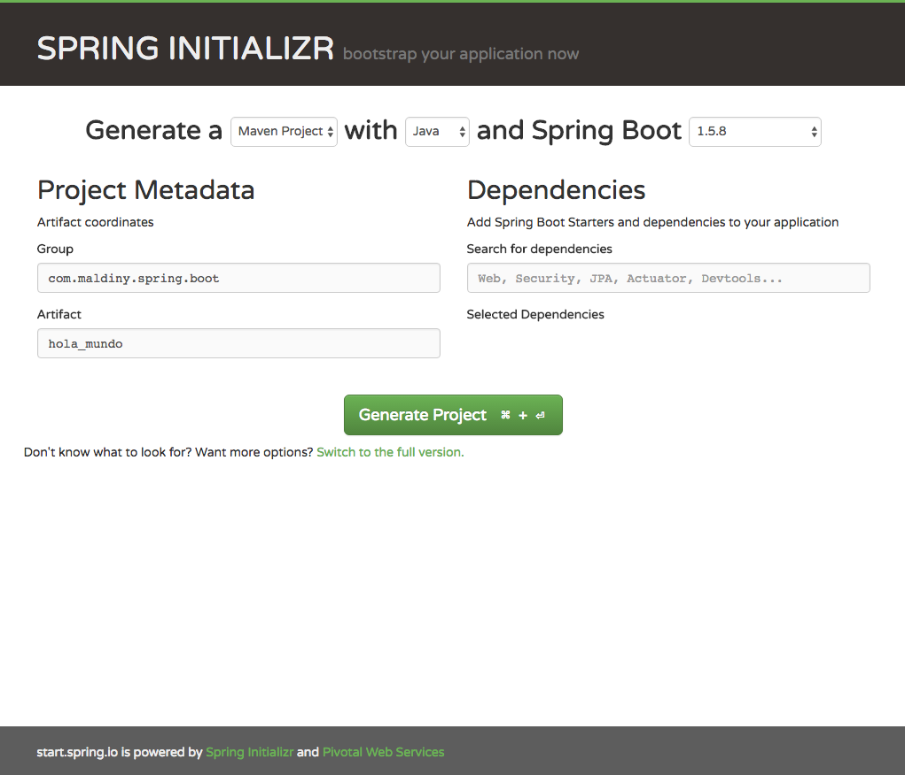
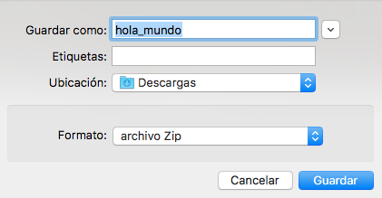
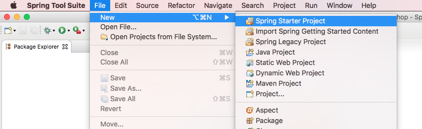
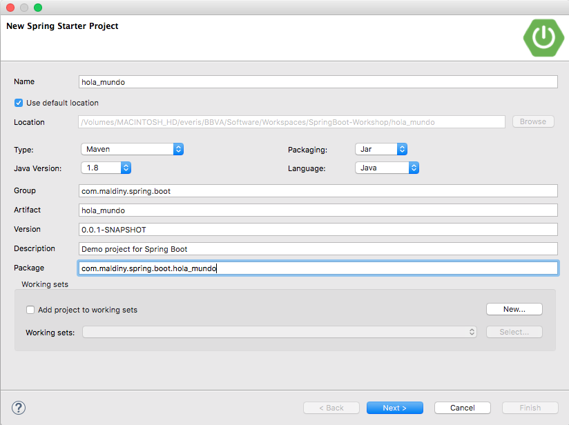
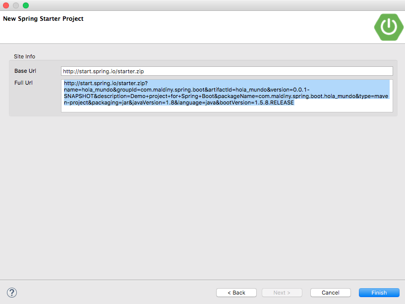
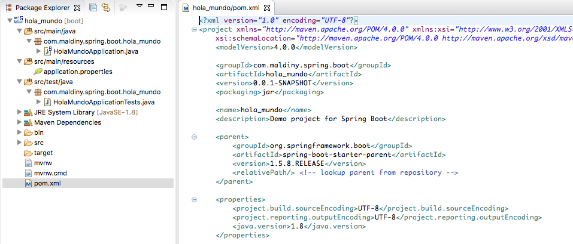
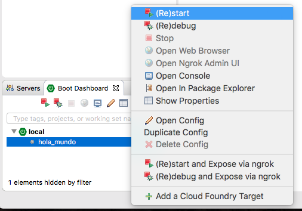
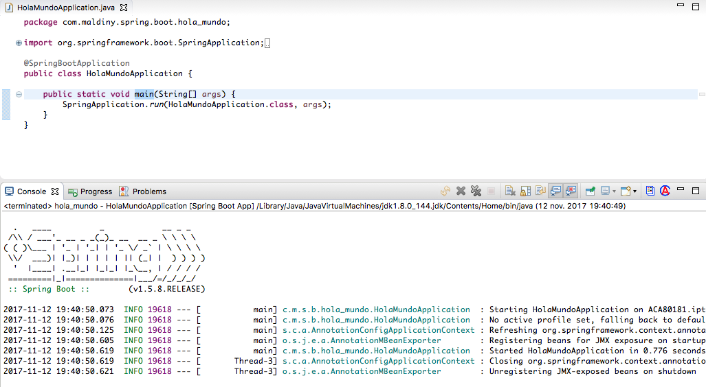
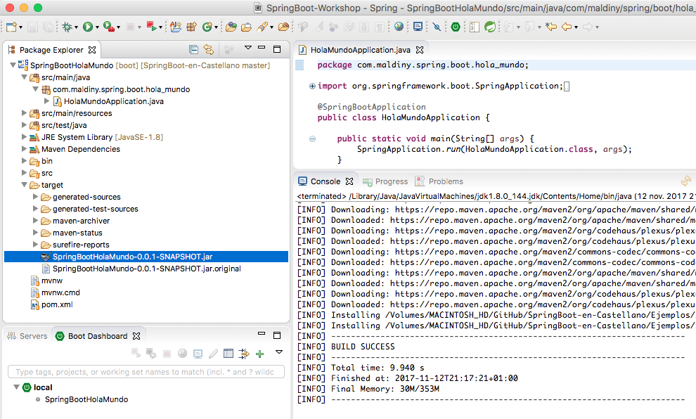
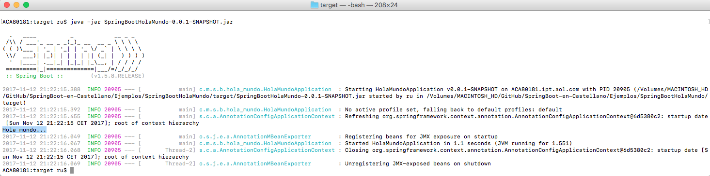

# Springboot-en-Castellano

SpringBoot es un framework de Spring que permite crear aplicaciones standalone, sin necesidad de un servidor de aplicaciones externo a ella.

Para iniciar una aplicación SB (SpringBoot a partir de ahora) bastará con ejecutar el comando "java -jar nombre_de_la_aplicacion.jar"

## Índice
  1. introducción
  2. instalación
  3. creación de una aplicación base y ejecución
  4. starters
  5. configuración mediante clases y autoconfiguración
  6. beans e inyección de depencias
  7. YAML como fichero de configuración
  8. CORS configuración
  9. seguridad
  10. configuración del contenedor embebido
  11. acceso a bases de datos SQL y NoSQL
  12. testeo de aplicaciones
  13. websockets
  14. webservices
  15. springboot actuator
  16. despliegue en cloud (cloud foundry, heroku, openshift, amazon y Google Cloud)
  17. springboot maven plugin
  18. consejos
  19. FAQs
  20. referencias

## Introducción

[`Spring Boot`] es un framework enfocado a la creación de aplicaciones basadas en Spring sin necesidad de contenedor de aplicaciones. 

A pesar de poder ejecutar aplicaciones SB en Java 6 y Java 7 se recomienda su uso a partir de la versión de Java 8.

Los servidores de aplicaciones enbebidos que permite ejecutar SB por defecto son los siguientes:

- Tomcat 8 empleando Java 7+.
- Tomcat 7 empleando Java 6+.
- Jetty 9.3 empleando Java 8+.
- Jetty 9.2 empleando Java 7+.
- Jetty 8 empleando Java 6+.
- Udertown 1.3 empleando Java 7+.

**[Ir al índice](#Índice)**

## Instalación
SB es compatible con Maven 3.2 o superior. Se puede consultar los pasos para realizar su instalación en la siguiente dirección [http://maven.apache.org/](http://maven.apache.org/).

**SpringBoot CLI**

SB CLi es una herramienta de comandos que se puede utilizar para realizar prototipado con Spring. Adicionalmente permitirá ejecutar scripts de groovy.

Es una herramienta opcional y para seguir los ejemplos y guias descritas a continuación no es necesario instalarlo.

Para validar si se encuentra instalado basta con ejecutar el siguiente comando en una consola:

```cmd
spring -version
Spring Boot v1.5.8.RELEASE
```

Se puede descargar e instalar manualmente a través del siguiente enlace:

[spring-boot-cli-1.5.8.RELEASE-bin.zip](https://repo.spring.io/release/org/springframework/boot/spring-boot-cli/1.5.8.RELEASE/spring-boot-cli-1.5.8.RELEASE-bin.zip)

Para sistemas operativos OSX (MAC) se podrá iniciar su instalación mediante los siguientes comandos:

```cmd
brew tap pivotal/tap
brew install springboot
```

**[Ir al índice](#Índice)**

## Creación de una aplicación base y ejecución

Para iniciar la construcción de nuestra primera aplicación SB se plantean varias alternativas. A continuación se enumeran dos de ellas:

- **Online Spring Initializr:** A través del portal https://start.spring.io/ se puede iniciar la construcción de una aplicación introduciendo el nombre del proyecto, sus coordenadas maven y realizando la selección de las dependencias que conocemos de antemano que va a necesitar nuestro proyecto. Estas dependencias únicamente nos las agregará al fichero pom.xml por lo que en caso de no agregarlas en la definición del proyecto podremos agregarlas manualmente con gran facilidad. Para nuestro primero proyecto el formulario quedará del siguiente modo:

<p align="center"></p>

Tras completar los datos se podrá descargar el proyecto generado en formato .zip.

<p align="center"></p>

- **STS plugin:** A través del propio ide STS que se puede descargar desde el siguiente [enlace](https://spring.io/tools/sts/all) se facilita de la posibilidad al usuario para crear un proyecto base. Para ello únicamente es necesario seguir los siguientes pasos:

<p align="center"></p>

Al igual que en la versión Online, únicamente es necesario completar los campos que se solicitan tal y como se ve a continuación:

<p align="center"></p>

Como se puede observar en el generador, el plugin integrado en el IDE finalmente realiza una invocación al endpoint online para generar el proyecto y descomprimirlo en el workspace que se este utilizando por lo que es fácilmente integrable en cualquier aplicación Ad hoc.

<p align="center"></p>

Una vez generado, se descargarán todas las dependencias maven necesarias para desplegar un proyecto SB. En caso de ser la primera ocasión en la que se realiza este paso puede demorarse varios minutos.

<p align="center"></p>

El proyecto hola_mundo esta preparado para poder ejecutarse. Para ello vamos a iniciar revisando las distintas formas que podemos emplear para lanzar el proyecto desde el STS:

1. Botón secundario sobre el proyecto > Run As > Spring Boot App 
2. En la parte inferior del IDE aparece la pestaña denominada *Boot Dashboard*, en ella aparecerán todos los proyectos de tipo SB que se encuentren importados en nuestro Workspace. Adicionalmente podremos agregar proyectos SB que se encuentren desplegados en la plataforma Cloud Foundry. Para lanzar un proyecto a través del *Boot Dashboard*, simplemente será necesario pulsar botón secundario sobre el proyecto y pulsar en (re)start.

<p align="center"></p>

A continuación podemos ver el resultado del arranque de esta primera aplicación:

<p align="center"></p>

Al no haber incorporado ningún codigo adicional, la aplicación no realiza operación alguna por lo que se inicia su ejecución y se finaliza tras el arranque. 

Vamos a incluir un bean en la clase *HolamundoApplication.java* que incluya la siguiente definición (más adelante veremos este tema):

```java
@SpringBootApplication
public class HolaMundoApplication {

	public static void main(String[] args) {
		SpringApplication.run(HolaMundoApplication.class, args);
	}
	
	@Bean 
	public String saluda(){
		System.out.println("Hola mundo...");
		return "";
	}
	
}
```

Si arrancamos de nuevo la aplicación veremos cómo aparece en los logs la frase que hemos introducido "Hola mundo...".

<p align="center"></p>

El código de este primer ejemplo de hola mundo se encuentra en el siguiente 
[enlace](https://github.com/maldiny/SpringBoot-en-Castellano/tree/master/Ejemplos/SpringBootHolaMundo).

Por otro lado, también es posible ejecutar la aplicación desde fuera del IDE por ejemplo desde línea de comando. Para ello es necesario realizar la compilación y empaquetado del proyecto generando el fichero *.jar. Para realizar esta acción basta con seleccionar con botón secundario el proyecto y pulsar sobre *Run As > Maven install*, se iniciará la descarga de las dependencias necesarias y finalmente generará el fichero *SpringBootHolaMundo-0.0.1-SNAPSHOT.jar* en la carpeta target del proyecto como se ve en la siguiente imagen:

<p align="center"></p>

Una vez empaquetado el proyecto y generado los binarios se puede realizar su ejecución accediendo al directorio "target" del proyecto mediante un terminal (cmd) y ejecutando el siguiente comando:

```cmd
java -jar SpringBootHolaMundo-0.0.1-SNAPSHOT.jar
```

Se puede ver a continuación el resultado obtenido:

<p align="center"></p>

**[Ir al índice](#Índice)**

## starters

Los starters de SB básicamente son configuraciones o artefactos maven que aglutinan una serie de dependencias previamente validadas que facilitan la configuración de ciertas características de una aplicación. 

El primero de estos starters de los que se hará uso al crear una aplicación SB es el *spring-boot-starter-1.5.8.RELEASE". Si accedemos al contenido del jar veremos que estará compuesto únicamente por la definición de un pom.xml que incluye una serie de artefactos maven como dependencias, concretamente, los artefactos maven que consituyen el core de SB:

<p align="center"></p>

A continuación vamos a nombrar y detallar algunos de los starters más significativos:

* **spring-boot-starter:** Core de SB que incluye el soporte a la configuración, sistema de logging y soporte para el uso de YAML de configuración.
* **spring-boot-starter-aop**: Starter de SB que permite trabajar con Spring AOP y AspectJ para el desarrollo de códito empleando aspectos.
* **spring-boot-starter-batch**: Starter que permitirá realizar desarrollos mediante el framework de Spring Batch para el procesado de lotes.
* **spring-boot-starter-cache**: Starter para utilizar los frameworks de Spring para el soporte al cacheo de información.
* **spring-boot-starter-cloud-connectors**: Starter de SB que incluye Spring Cloud Connectors que simplifican la conectividad con los servicios de plataformas cloud como Cloud Foundry y Heroku.
* **spring-boot-starter-data-jpa**: Starter de SB para utilizar Spring Data JPA con Hibernate.
* **spring-boot-starter-mongodb**: Starter de SB que facilita utilizar MongoDB como sistema de persistencia NoSQL y Spring Data MongoDB.
* **spring-boot-starter-data-rest**: Starter de SB que facilita la creación y exposición de repositorios configurados con Spring Data sobre el protocolo REST mediante el uso de Spring Data REST.
* **spring-boot-starter-jdbc**: Starter de SB que permite establecer un pool de conexiones JDBC mediante el uso de Tomcat JDBC.
* **spring-boot-starter-jersey**: Alternativa a spring-boot-starter-web que permite construir aplicaciones RESTful usando JAX-RS y Jersey.
* **spring-boot-starter-mail**: Starter de SB que facilita el envio de emails mediante el api de Java Mail y el framework de Spring.
* **spring-boot-starter-test**: Starter de SB que facilita un framework y las librerías necesarias incluyendo JUnit, Hamcrest y Mockito para testear las aplicaciones SB.
* **spring-boot-starter-web**: Starter de SB que permite realizar el desarrollo web incluyendo el desarrollo de servicios RESTful y aplicaciones usando Spring MVC. Usa Apache Tomcat como contenedor por defecto.
* **spring-boot-starter-web-services**: Starter de SB para usar Spring Web Services.
* **spring-boot-starter-websocket**: Starter de SB que permite construir aplicaciones que establezcan comunicaciones basadas en el framework de Spring para WebShockets.
* **spring-boot-starter-actuator**: Starter de SB que provee de capacidades de monitorización y gestión de las aplicaciones SB.

Otros starters interesantes a tener en cuenta son *spring-boot-starter-jetty,spring-boot-starter-log4j2, spring-boot-starter-logging, spring-boot-starter-tomcat, spring-boot-starter-undertow, spring-boot-starter-security*.

**[Ir al índice](#Índice)**

## configuración mediante clases y autoconfiguración

### importar xml de configuración

A pesar de haber modificado la forma en la que se define la configuración para SB, es posible seguir definiendo los beans y ciertos aspectos de configuración mediante ficheros XML e importando dicha configuración mediante la anotación 
**@ImportResource**.

### auto-configuración

SB configura automáticamente la aplicación en función de las dependencias agregadas al proyecto. Para activar esta característica será necesario agregar la anotación **@EnableAutoConfiguration** o **@SpringBootApplication** a alguna de las clases de configuración.

Para poder revisar la configuración incluida automática en la aplicación se puede incluir en los logs de arranque de la aplicación el parámetro **--debug**.

Para poder excluir alguna configuración realizada automáticamente bastará con incluir la siguiente definición:

```java
@Configuration 
@EnableAutoConfiguration(exclude={DataSourceAutoConfiguration.class}) 
public class MyConfiguration {...}
```

En cualquier fichero de configuración del proyecto se podrá incluir configuración específica que sobreescriba la configuración definida automáticamente en el proyecto.

**[Ir al índice](#Índice)**

## beans e inyección de depencias

Para realizar la definición de los objetos y su inyección de dependencias podrá emplearse la anotación **@ComponentScan** como anotación de alguno de los ficheros de configuración dónde se indicará el path dónde se encuentran de forma recursiva los objetos a instanciar mediante anotaciones del tipo @Component, @Service, @Repository, @Controller, ...

```java
@Configuration
@ComponentScan("com.maldiny")
@ImportXml("classpath:com/maldiny/datasource-config.xml")
public class Config {
}
```

**[Ir al índice](#Índice)**

## YAML como fichero de configuración

YAML es un formato de especificar información de configuración de forma jerárquica. La librería SnakeYAML permitirá incorporar este tipo de configuración por defecto al configurar el proyecto mediante el **spring-boot-starter**.

```yaml
com: 
	maldiny:
		moneda: euro
		precio: 10
	env:
		url: local
```

```yaml
com.maldiny.moneda=euro 
com.maldiny.precio=10
com.env.url=local
```

**[Ir al índice](#Índice)**

## CORS configuración

En cualquier navegador moderno, el "Cross-Origin Resource Sharing" o más conocido como *CORS* es una especificación que se inició con la introducción del HTML5 y los clientes Javascript que realizan consultas via REST a APIs que permite o deniega el acceso a estos servicios con el fin de introducir una capa adicional de seguridad a las APIs.

En muchos casos, el host que sirve los ficheros estáticos (index.html por ejemplo) no es el mismo host que sirve la información mediante APIs. 

En este caso, SB provee de distintas opciones para abilitar el acceso a los servicios implementados en la aplicación.

- En primer lugar, se puede habilitar el acceso CORS a nivel de método mediante la anotación *@CrossOrigin* del siguiente modo:

```java
@CrossOrigin
@RequestMapping(value="/cross_origin_enabled", method = RequestMethod.GET)
public String enabled(ModelMap model) {
  return "enabled";
}
```

- En segundo lugar, en caso de desear habilitar el CORS para todos los servicios de un mismo controlador es posible incluir esta anotación a nivel de clase del siguiente modo:

```java
@RestController
@CrossOrigin(origins = "http://example.com", maxAge = 3600)
public class ServiceController {...}
```

- En último lugar, es posible realizar la configuración CORS para todos los servicios de una aplicación incluyendo la siguiente configuración:

```java
@Configuration
@EnableWebMvc
public class WebConfig extends WebMvcConfigurerAdapter {

  @Override
  public void addCorsMappings(CorsRegistry registry) {
    registry.addMapping("/**");
  }
}
```

Se puede encontrar un ejemplo completo de configuración del CORS en SB en el siguiente [enlace](https://github.com/maldiny/SpringBoot-en-Castellano/tree/master/Ejemplos/SpringBootCORS).

**[Ir al índice](#Índice)**

## seguridad

**[Ir al índice](#Índice)**

## configuración del contenedor embebido

**[Ir al índice](#Índice)**

## acceso a bases de datos SQL y NoSQL

**[Ir al índice](#Índice)**

## testeo de aplicaciones

**[Ir al índice](#Índice)**

## websockets

Como hemos visto anteriormente, SB facilita el starter **spring-boot-starter-websocket** para realizar la creación y configuración de websockets.

Para empezar será necesario incorporar las siguientes dependencias:

```xml
		<dependency>
			<groupId>org.webjars</groupId>
			<artifactId>sockjs-client</artifactId>
			<version>1.0.2</version>
		</dependency>
		<dependency>
			<groupId>org.webjars</groupId>
			<artifactId>stomp-websocket</artifactId>
			<version>2.3.3</version>
		</dependency>
		<dependency>
			<groupId>org.springframework.boot</groupId>
			<artifactId>spring-boot-starter-websocket</artifactId>
		</dependency>
```

A continuación, es necesario establecer los canales por los que se realizará la emisión de la información:

```java
@Configuration
@EnableWebSocketMessageBroker
public class WebSocketConfig extends AbstractWebSocketMessageBrokerConfigurer {

    @Override
    public void configureMessageBroker(MessageBrokerRegistry config) {
        config.enableSimpleBroker("/topic");

        config.setApplicationDestinationPrefixes("/app")
        .enableSimpleBroker("/time");
    }

    @Override
    public void registerStompEndpoints(StompEndpointRegistry registry) {
        registry.addEndpoint("/socket")
        .setAllowedOrigins("*")
        .withSockJS();
    }

}
```

Una vez realizada la configuración del socket, es necesario comenzar a emitir la información. Para ello lo realizaremos utilizando la clase **SimpMessagingTemplate**:

```java
@Controller
public class WebSocketController {

    private final SimpMessagingTemplate template;

    @Autowired
    WebSocketController(SimpMessagingTemplate template){
        this.template = template;
    }
    
    @Scheduled(fixedRate = 10)
    public void reportCurrentTime() {
    	this.template.convertAndSend("/time",  new SimpleDateFormat("HH:mm:ss.SSS").format(new Date()));
    }
}
```

En este ejemplo, estaremos emitiendo la hora exacta cada 10 milisegundos a través del canal "/time" para que todos aquellos clientes suscritos a este canal puedan recibir la información.

Se puede encontrar un ejemplo completo de publicación de Websockets mediante SB y consumo mediante una aplicación Angular5 en el siguiente [enlace](https://github.com/maldiny/SpringBoot-en-Castellano/tree/master/Ejemplos/SpringBootWebsocket).

**[Ir al índice](#Índice)**

## webservices

**[Ir al índice](#Índice)**

## springboot actuator

SB Actuator es un módulo que permite realizar monitorización y gestión del estado de las aplicaciones en tiempo de ejecución.

Para poder activar esta feature en nuestras aplicaciones SB bastará con agregar el siguiente módulo:

```xml
<dependency>
  <groupId>org.springframework.boot</groupId>
  <artifactId>spring-boot-starter-actuator</artifactId>
</dependency>
```

El SB Actuator habilitará los siguientes endpoints de gestión en nuestras aplicaciones:

* **/actuator**: Muestra el listado de endpoints. Requiere Spring HATEOAS.
* **/auditevents**: Expone información sobre eventos.
* **/autoconfig**: Muestra toda la configuración de la aplicación.
* **/beans**: Muestra la list completa de beans.

```elixir
[
    {
        "context": "application",
        "parent": null,
        "beans": [
        {
            "bean": "holaMundoApplication",
            "aliases": [],
            "scope": "singleton",
            "type": "com.maldiny.spring.boot.hola_mundo.HolaMundoApplication$$EnhancerBySpringCGLIB$$ad10771c",
            "resource": "null",
            "dependencies": []
        },
        {
            "bean": "org.springframework.boot.autoconfigure.internalCachingMetadataReaderFactory",
            "aliases": [],
            "scope": "singleton",
            "type": "org.springframework.core.type.classreading.CachingMetadataReaderFactory",
            "resource": "null",
            "dependencies": []
        },
 	...
```

* **/configprops**: Muestra la lista de @ConfigurationProperties.

```elixir
{
	"endpoints-org.springframework.boot.actuate.endpoint.EndpointProperties": {
		"prefix": "endpoints",
		"properties": {
			"enabled": true,
			"sensitive": null
		}
	},
	"management.info-org.springframework.boot.actuate.autoconfigure.InfoContributorProperties": {
    	"prefix": "management.info",
    	"properties": {
        	"git": {
            	"mode": "SIMPLE"
          	}
      	}
	},
	...
}
```

* **/dump**: Realiza un dump de los hilos y memoria de la aplicación.
* **/env**: Muestra la configuración de entorno - ConfigurableEnvironment.

```elixir
{
	"profiles": [],
	"server.ports": {
		"local.server.port": 8080
	},
	"commandLineArgs": {
		"spring.output.ansi.enabled": "always"
	},
	"servletContextInitParams": {},
	"systemProperties": {
        "com.sun.management.jmxremote.authenticate": "false",
        "java.runtime.name": "Java(TM) SE Runtime Environment",
        "sun.boot.library.path": "/Library/Java/JavaVirtualMachines/jdk1.8.0_144.jdk/Contents/Home/jre/lib",
        "java.vm.version": "25.144-b01",
        "gopherProxySet": "false",
        "java.vm.vendor": "Oracle Corporation",
        "java.vendor.url": "http://java.oracle.com/",
        "java.rmi.server.randomIDs": "true",
        "path.separator": ":",
        "java.vm.name": "Java HotSpot(TM) 64-Bit Server VM",
        "file.encoding.pkg": "sun.io",
 	...
```

* **/flyway**: Muestra cualquier migración de base de datos aplicada.
* **/health**: Muestra la información de salud de la aplicación.

```python
{
    "status": "UP",
    "diskSpace": {
        "status": "UP",
        "total": 749296615424,
        "free": 266393800704,
        "threshold": 10485760
    }
}
```

* **/info**: Muestra información sobre la aplicación.
* **/loggers**: Muestra la configuración de los loggers configurados.

```elixir
{
    "levels": [
        "OFF",
        "ERROR",
        "WARN",
        "INFO",
        "DEBUG",
        "TRACE"
    ],
    "loggers": {
        "ROOT": {
        	"configuredLevel": "INFO",
        	"effectiveLevel": "INFO"
        },
        "com": {
        	"configuredLevel": null,
        	"effectiveLevel": "INFO"
        },
        "com.maldiny": {
        	"configuredLevel": null,
        	"effectiveLevel": "INFO"
        },
        "com.maldiny.spring": {
        	"configuredLevel": null,
        	"effectiveLevel": "INFO"
        },
 	...
```

* **/metrics**: Muestra métricas de la aplicación.

```elixir
{
    "mem": 247363,
    "mem.free": 149087,
    "processors": 8,
    "instance.uptime": 33459034,
    "uptime": 8235865,
    "systemload.average": 1.73974609375,
    "heap.committed": 185344,
    "heap.init": 262144,
    "heap.used": 36256,
    "heap": 3728384,
    "nonheap.committed": 63488,
    "nonheap.init": 2496,
    "nonheap.used": 62021,
    "nonheap": 0,
    "threads.peak": 42,
    "threads.daemon": 28,
    "threads.totalStarted": 90,
    "threads": 30,
    "classes": 6891,
    "classes.loaded": 6963,
    "classes.unloaded": 72,
    "gc.ps_scavenge.count": 19,
    "gc.ps_scavenge.time": 119,
    "gc.ps_marksweep.count": 5,
    "gc.ps_marksweep.time": 598,
    "httpsessions.max": -1,
    "httpsessions.active": 0,
    "gauge.response.mappings": 2,
    "gauge.response.actuator": 5,
    "gauge.response.beans": 7,
    "gauge.response.trace": 22,
    "gauge.response.autoconfig": 12,
    "gauge.response.health": 2,
    "gauge.response.auditevents": 10,
    "gauge.response.heapdump": 2600,
    "gauge.response.info": 2,
    "gauge.response.star-star.favicon.ico": 3,
    "gauge.response.loggers": 4,
    "gauge.response.env": 2,
    "gauge.response.configprops": 42,
    "counter.status.200.actuator": 2,
    "counter.status.200.mappings": 2,
    "counter.status.200.loggers": 2,
    "counter.status.200.configprops": 3,
    "counter.status.200.heapdump": 2,
    "counter.status.200.health": 2,
    "counter.status.200.autoconfig": 1,
    "counter.status.200.env": 3,
    "counter.status.200.trace": 1,
    "counter.status.200.info": 1,
    "counter.status.200.star-star.favicon.ico": 2,
    "counter.status.200.beans": 2,
    "counter.status.200.auditevents": 1
}
```

* **/mappings**: Muestra el listado de paths configurados @RequestMapping.

```elixir
{
    "/webjars/**": {
    	"bean": "resourceHandlerMapping"
    },
    "/**": {
    	"bean": "resourceHandlerMapping"
    },
    "/**/favicon.ico": {
    	"bean": "faviconHandlerMapping"
    },
    "{[/error]}": {
    	"bean": "requestMappingHandlerMapping",
    	"method": "public org.springframework.http.ResponseEntity<java.util.Map<java.lang.String, java.lang.Object>> org.springframework.boot.autoconfigure.web.BasicErrorController.error(javax.servlet.http.HttpServletRequest)"
    },
 	...
```

* **/shutdown**: Permite realizar la parada de la aplicación. 
* **/trace**: Muestra las peticiones HTTP recibidas.

```elixir
[
	{
        "timestamp": 1514098780366,
        "info": {
        	"method": "GET",
        	"path": "/metrics",
        	"headers": {
                "request": {
                    "host": "localhost:8080",
                    "connection": "keep-alive",
                    "upgrade-insecure-requests": "1",
                    "user-agent": "Mozilla/5.0 (Macintosh; Intel Mac OS X 10_12_6) AppleWebKit/537.36 (KHTML, like Gecko) Chrome/63.0.3239.84 Safari/537.36",
                    "accept": "text/html,application/xhtml+xml,application/xml;q=0.9,image/webp,image/apng,*/*;q=0.8",
                    "referer": "http://localhost:8080/actuator",
                    "accept-encoding": "gzip, deflate, br",
                    "accept-language": "es-ES,es;q=0.9,en;q=0.8,gl;q=0.7",
                    "cookie": "JSESSIONID=4E6D5A7AD96290FFFFAC2F8F811AF3DC; _ga=GA1.1.2071860829.1512756778; utag_main=v_id:0160375494530032df70be8b952605078001807000ac2$_sn:3$_ss:0$_st:1513168351341$ses_id:1513166309309%3Bexp-session$_pn:1%3Bexp-session"
                },
                "response": {
                    "X-Application-Context": "application",
                    "Content-Type": "application/vnd.spring-boot.actuator.v1+json;charset=UTF-8",
                    "Transfer-Encoding": "chunked",
                    "Date": "Sun, 24 Dec 2017 06:59:40 GMT",
                    "status": "200"
                }
            },
            "timeTaken": "8"
        }
    },
	...
```

* **/docs**: Muestra documentación sobre las peticiones. Requiere SB actuator docs.
* **/heapdump**: Realiza la descarga en formato GZip del head dump de memoria. 
* **/jolokia**: Expone los beans JMX a través de HTTP. Requiere Jolokia.
* **/logfile**: Muestra el contenido del fichero de log en caso de que se haya configurado las propiedades logging.file o logging.path. 

Para evitar tener que recordar todos estos enpoints, se puede agregar la dependencia de SB HATEOAS en el fichero pom.xml:

```xml
<dependency>
  <groupId>org.springframework.hateoas</groupId>
  <artifactId>spring-hateoas</artifactId>
</dependency>
````

De este modo al acceder al endpoint http://localhost:8080/actuator podremos obtener el listado de todos los endpoints disponibles de una forma fácil y rápida:

[TODO: Captura de pantalla]

Con esta configuración es posible que se encuentren deshabilitados gran cantidad de las features que proporciona SB Actuator hasta que se configure algún mecanismo de autenticación. En caso de no ser necesario se puede configurar la aplicación introduciendo la siguiente configuración en el fichero application.properties:

```properties
management.security.enabled=False
```
	
Se puede encontrar un ejemplo completo de configuración de SB Actuator en el siguiente [enlace](https://github.com/maldiny/SpringBoot-en-Castellano/tree/master/Ejemplos/SpringBootActuator).
    

**[Ir al índice](#Índice)**

## despliegue en cloud (cloud foundry, heroku, openshift, amazon y Google Cloud)

**[Ir al índice](#Índice)**

## springboot maven plugin

El plugin de maven para SB se denomina **spring-boot-maven-plugin**. Para hacer uso de él en un proyecto, basta con importarlo en el pom.xml del siguiente modo:

```xml
<?xml version="1.0" encoding="UTF-8"?>
<project xmlns="http://maven.apache.org/POM/4.0.0" xmlns:xsi="http://www.w3.org/2001/XMLSchema-instance" xsi:schemaLocation="http://maven.apache.org/POM/4.0.0 http://maven.apache.org/xsd/maven-4.0.0.xsd"> <modelVersion>4.0.0</modelVersion>
<!-- ... -->
    <build>
        <plugins>
        	<plugin>
                <groupId>org.springframework.boot</groupId>
                <artifactId>spring-boot-maven-plugin</artifactId>
                <version>1.5.8.RELEASE</version>
                <executions>
                    <execution>
                        <goals>
                            <goal>repackage</goal>
                        </goals>
                    </execution>
                </executions>
            </plugin>
        </plugins>
    </build>
</project>
```

Este plugin permitirá realizar el empaquetado del proyecto en un JAR o WAR ejecutable que se generará en la carpeta target del proyecto.

Se generará un JAR o bien un WAR en función del tipo de empaquetado que se especifique en el propio fichero pom.xml en el apartado **packaging**:

```xml
<!-- ... -->
<packaging>jar</packaging>
<!-- ... -->
```

Para forzar el empaquetado desde la consola de comandos se ejecutará la siguiente sentencia:

```cmd
mvn package
```

**[Ir al índice](#Índice)**

## consejos

En el siguiente apartado se han recopilado distintos consejos obtenidos con la experiencia a la hora de realizar desarrollos mediante el framework de SB:

### refresco automático de la aplicación durante la codificación

Una de las características más deseadas de los programadores a la hora de implementar sus desarrollos es el poder compilar la aplicación automáticamente sin necesidad de estar deteniendo y redesplegando en el servidor los cambios realizados, principalmente si se tratan de cambios sencillos en algún fichero de estáticos.

En los proyectos SB es posible aplicar este tipo de configuración de refresco automático. Para ello únicamente es necesario incluir en el fichero *pom.xml* la dependencia a *spring-boot-devtools* del siguiente modo:

```xml
<dependency>
  <groupId>org.springframework.boot</groupId>
  <artifactId>spring-boot-devtools</artifactId>
</dependency>
```

### despliegue de bootstrap y jquery

Para poder desplegar las librerías de presentación para integrar aplicaciones basadas en bootstrap y jquery será necesario incluir las siguientes dependencias en el fichero *pom.xml*:

```xml
<!-- Agregar los ficheros estáticos de bootstrap en el directorio webjars/bootstrap/... -->
<dependency>
  <groupId>org.webjars</groupId>
  <artifactId>bootstrap</artifactId>
  <version>3.3.6</version>
</dependency>

<!-- Agregar los ficheros estáticos de jquery el directorio webjars/jquery/... -->
<dependency>
  <groupId>org.webjars</groupId>
  <artifactId>jquery</artifactId>
  <version>1.9.1</version>
</dependency>
```

Para hacer uso de cualquiera de ellas en una jsp podrá realizarse del siguiente modo:

```html
<script src="webjars/jquery/1.9.1/jquery.min.js"></script>
<script src="webjars/bootstrap/3.3.6/js/bootstrap.min.js"></script>
````

### embeber una aplicación Angular en una aplicación Spring Boot

En muchas ocasiones se dará el caso en el que se quiera realizar una aplicación SB en la que se implementen una serie de servicios de negocio mediante Webservices o Websockets, con una capa de presentación realizada con algún framework de presentación como puede ser Angular. 

Para poder llevar a cabo esta integración, es necesario incorporar el ciclo de compilado de fuentes de Angular en el ciclo de compilado de fuente de la aplicación SB mediante el uso de maven.

En primer lugar hablaremos de la estructura de directorios necesaria:

```xml
└── src
    └── main
        └── java
            └── hello
````

Se puede encontrar un ejemplo completo de publicación de Websockets mediante SB y consumo mediante una aplicación Angular5 en el siguiente [enlace](https://github.com/maldiny/SpringBoot-en-Castellano/tree/master/Ejemplos/SpringBootWebsocket).

**[Ir al índice](#Índice)**

## Referencias

* [Introducing Spring Batch - Dave Sayer - Spring Source](http://jaoo.dk/dl/qcon-london-2008/slides/DaveSyer_IntroducingSpringBatch.pdf)
* [Spring Batch Reference Documentation 3.0 - Lucas Ward - Pivotal](http://docs.spring.io/spring-batch/reference/pdf/spring-batch-reference.pdf)
* [Spring Batch Admin User Guide - Lucas Ward - Pivotal](http://docs.spring.io/spring-batch-admin/reference/reference.xhtml)
* [Spring Batch - Reference Documentation](http://docs.spring.io/spring-batch/reference/htmlsingle/)
* [Transactions in Spring Batch – Part 1: The Basics](https://blog.codecentric.de/en/2012/03/transactions-in-spring-batch-part-1-the-basics/)
* [Transactions in Spring Batch – Part 2: Restart, cursor based reading and listeners](https://blog.codecentric.de/en/2012/03/transactions-in-spring-batch-part-2-restart-cursor-based-reading-and-listeners/)
* [Transactions in Spring Batch – Part 3: Skip Retry](https://blog.codecentric.de/en/2012/03/transactions-in-spring-batch-part-3-skip-and-retry/)
* [Aprender Spring Batch con ejemplos](http://www.adictosaltrabajo.com/tutoriales/aprende-spring-batch-con-ejemplos/)
* [Ejemplos de Spring Batch](https://github.com/spring-projects/spring-batch/tree/master/spring-batch-samples)

**[Ir al índice](#Índice)**
